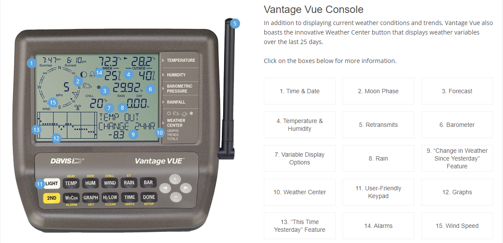

# tcss360_project1
Project Assignment #01 – Weather Monitoring Station Software

## Instructions

Submit by 11:59 pm on Mon, Jan 27th, 2020

Revision History: First release on Jan 15th.

*If you find any errors, inconsistencies, ambiguities, and/or missing information in this description, please let the instructor know about them and make reasonable assumptions and/or apply workarounds to be able to come up with a solution that satisfies the main goals of the assignment.*

You are going to build a software product that will work with the hardware products provided by Davis Instruments (https://www.davisinstruments.com/).  Assume that you have decided to focus only on the Vantage Vue (https://www.davisinstruments.com/solution/vantage-vue/) offered as a low-priced product for beginners. You will develop a standalone software console application for the Vantage Vue Weather Station, which collects all measurements from the “Vantage Vue Integrated Sensor Suite” and replaces the functionality of the custom-built “Vantage Vue Wireless Console” equipment. 

Since you do not have the actual “Vantage Vue Integrated Sensor Suite”, you should develop a proxy software that takes its place so that you will to be able to demonstrate and test your product.  

*Hint: The textbook includes a case study on a wilderness weather station where you can benefit while you work on this project.*

## Vantage Vue Console

## Vantage Vue Simulator
TODO include simulator picture

### Simulator Controls
TODO include simulator button layout and features
